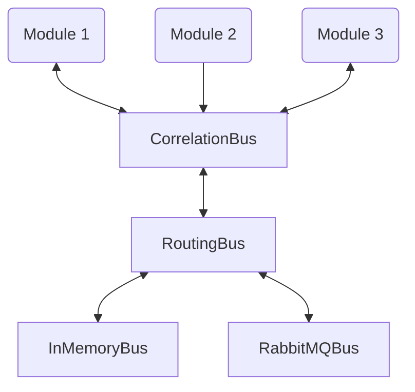

# Caryatid Process library

This library provides most of the implementation of Caryatid, and allows the simple creation of a microservice `main.rs` in a few lines of code.

### main.rs
A Caryatid microservice `main.rs` looks like this:

```rust
use caryatid_process::Process;
use anyhow::Result;
use config::{Config, File, Environment};
use tracing::info;
use tracing_subscriber;
use std::sync::Arc;

// Reference modules to include
mod my_module;
use my_module::MyModule;
// ...

// Define the message type - this may be JSON, or a custom enum
type MType = serde_json::Value;

/// Standard main
#[tokio::main]
pub async fn main() -> Result<()> {

    // Initialise tracing
    tracing_subscriber::fmt::init();

    // Read the config
    let config = Arc::new(Config::builder()
        .add_source(File::with_name("example"))
        .add_source(Environment::with_prefix("CARYATID"))
        .build()
        .unwrap());

    // Create the process
    let mut process = Process::<MType>::create(config).await;

    // Register modules
    MyModule::register(&mut process);
    // ...

    // Run it
    process.run().await?;

    Ok(())
}
```

`MyModule` would be defined as described in the [SDK](../sdk).

### Configuration

The configuration for this example would be in `example.toml` (or any other format supported by `config`), and look like this:

```toml
[module.my-module]
# ... Any configuration for MyModule ...

[message-bus.external]
class = "rabbit-mq"
url = "amqp://127.0.0.1:5672/%2f"
exchange = "caryatid"

[message-bus.internal]
class = "in-memory"
workers = 10

# Message routing
[[message-router.route]]  # Selected go to external
pattern = "system.#"
bus = "external"

[[message-router.route]]  # Some go to both
pattern = "broadcast.#"
bus = [ "internal", "external" ]

[[message-router.route]]  # Default to internal
pattern = "#"
bus = "internal"
```

The global configuration contains a table for each module named `module.<module-id>` which holds its configuration, and is passed
to the modules `init()` function.

By default the type (class) of the module to create is taken from the ID, which is the usual case if there is only one:

```rust
[module.my-module]
...
```

However if there is more than one instance of the module, they must have different IDs, and the type is specified with a 'class' property:

```rust
[module.my-module-2]
class = "my-module"
... 
```

The message buses and routing is also configured in the global configuration, as described below.

## Message bus structure

The message bus structure that the Process creates is as follows:



## Components

The major components of the `process` library are:

### [Process](src/process.rs)

Process manages the setup of the message bus infrastructure, registration and creation of the modules from the config.  
It is generic, parameterised by the message type in use with all modules within it.  It is created with the global configuration:

```rust
    let mut process = Process::<MType>::create(config).await;
```

Modules are then registered into it:

```rust
    MyModule::register(&mut process);
```

The process is then `run()` to configure and start all the modules:

```rust
    process.run().await?;
```

`run()` will exit on receipt of SIGTERM, when it will also shut down all the message infrastructure.

### [InMemoryBus](src/in_memory_bus.rs)

InMemoryBus provides an implementation of the generic `MessageBus` which passes messages in memory, 
without encoding or copying the messages, which means it can be very efficient.  On publishing a
message, it passes it (via a `channel`) to a dispatcher task, which in turns passes it on to one
of a number of worker tasks which call any subscribers to the given topic.

The only configuration is the number of worker tasks, which defaults to 4:

```toml
[message-bus.internal]
class = "in-memory"
workers = 10
```

### [RabbitMQBus](src/rabbit_mq_bus.rs)

RabbitMQBus implements `MessageBus` with an interface to a [RabbitMQ](https://www.rabbitmq.com/) external
message bus.  Messages are serialised into, and deserialsed from, [CBOR](https://cbor.io) using `serde`.

Each RabbitMQBus creates a single connection to RabbitMQ, with a single channel for outgoing messages
and a single topic exchange for pub-sub.  Each topic subscription then creates its own channel, queue and
consumer for that topic.

The configuration for a RabbitMQ bus includes the connection URL and the topic exchange name:

```rust
[message-bus.external]
class = "rabbit-mq"
url = "amqp://127.0.0.1:5672/%2f"
exchange = "caryatid"
```

### [RoutingBus](src/routing_bus.rs)

The RoutingBus creates a pseudo-`MessageBus` which sits above other message buses and routes published messages to them
according to topic.  Subscriptions are also routed the same way.

Routes are configured in an array of `[message-router.route]` tables:

```toml
[[message-router.route]]
pattern = "system.#"
bus = "external"
```

Each table takes a `pattern`, which can have wildcards `*` for any one word in a dotted list, and `#` for any number of words.
The bus ID that these messages should be routed to, or subscribed from, is then given by `bus`.

Messages can be routed to multiple buses by providing an array to `bus`:

```toml
[[message-router.route]]
pattern = "broadcast.#"
bus = [ "internal", "external" ]
```

### [CorrelationBus](src/colleration_bus.rs)

The CorrelationBus provides a request/response overlay on top of the basic publish-subscribe.  For each `request()` it
creates a random ID, and publishes on `{topic}.{id}`.  If it hasn't already done so, it also subscribes on `topic.*.response`
for all responses to that topic, which demultiplexes the responses, extracts the request ID and response message 
and signals completion to that request, which triggers the `request()` to return it.

On the handler side, it subscribes to `{topic}.*`, passes the request to the handler, then sends back the handler's result
on `{request_topic).response`.

The result is a simple asynchronous request/response interface for both caller and callee, which works on top of any message bus.

The only configuration for a CorrelationBus is the timeout (in seconds, default 5) it applies before erroring if nothing is available to
handle the request:

```toml
[message-correlator]
timeout = 5
```

In the current Process, it is the CorrelationBus that is actually passed to modules as the `MessageBus` in the `Context`, but this may change in the future.

